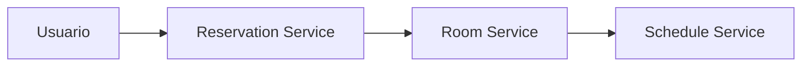
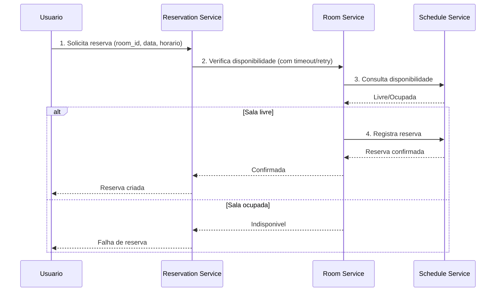

# Modelagem do sistema distribuido - Reserva de Salas

## 1) Componentes

## 2) Fluxo real de reserva

## 3) Resiliencia e seguranca (consistencia operacional)

- Retry: `Reservation Service` tenta novamente ao chamar `Room Service`.
- Timeout: `Reservation Service` limita tempo de espera da resposta.
- Fallback: se `Room Service` falhar apos retries, pedido entra em `pending_manual_review`.
- Idempotencia: `Reservation Service` exige `Idempotency-Key` para evitar reservas duplicadas em reenvios.
